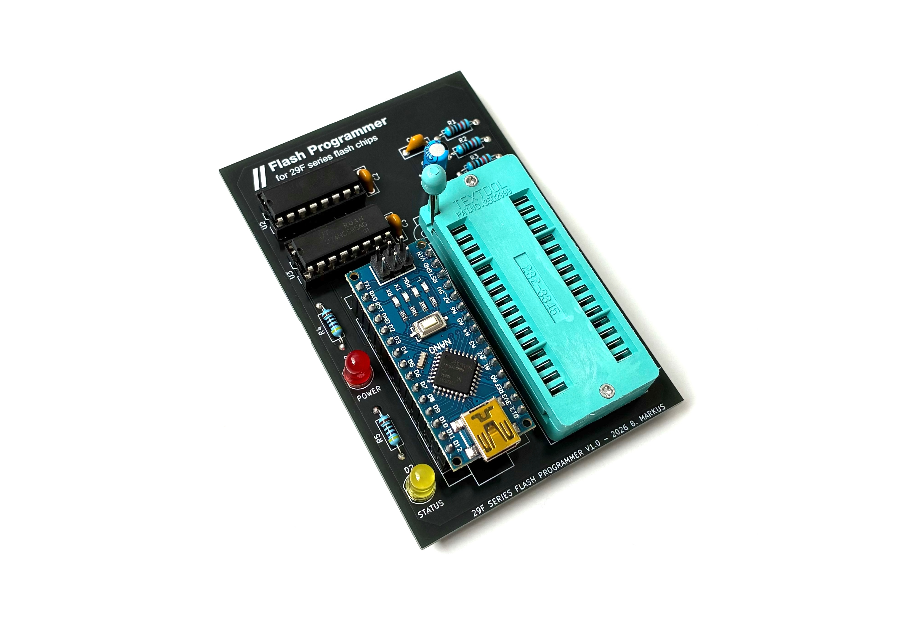
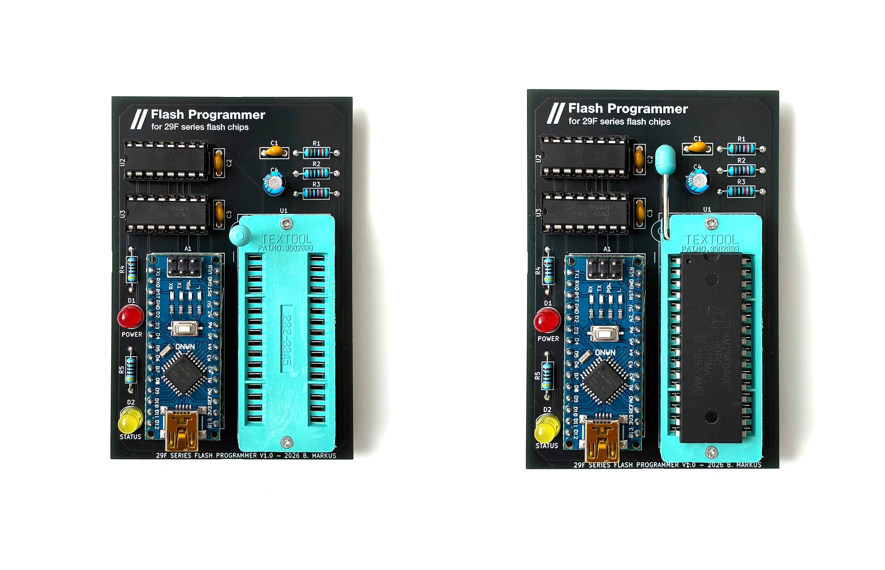
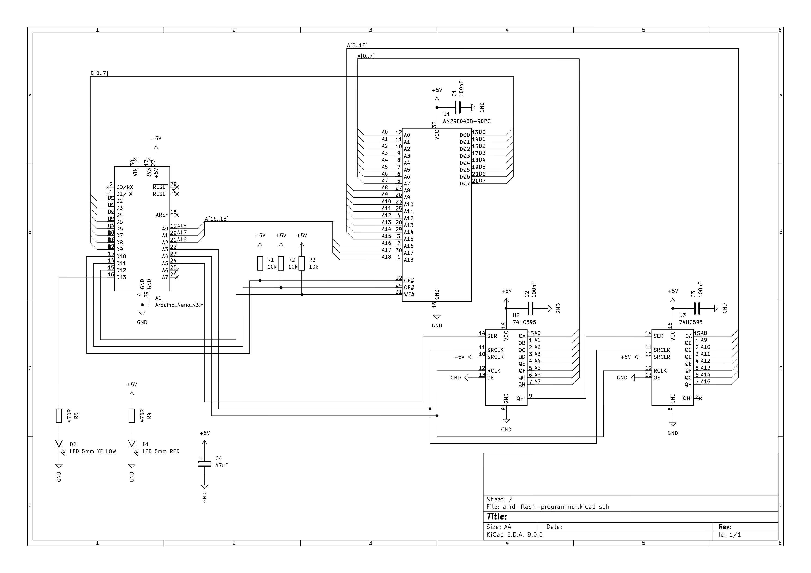
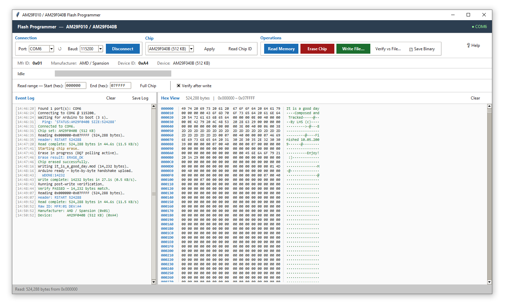

# amd-flash-programmer
A simple Arduino-based flash memory programmer for AM29F010 and AM29F040B series flash chips.



---

## Table of Contents

- [Overview](#overview)
- [Features](#features)
- [Hardware](#hardware)
  - [Schematic](#schematic)
  - [How It Works](#how-it-works)
  - [Bill of Materials](#bill-of-materials)
  - [Pin Mapping](#pin-mapping)
  - [Supported Chips](#supported-chips)
  - [PCB](#pcb)
- [Firmware](#firmware)
  - [Architecture](#architecture)
  - [Serial Protocol](#serial-protocol)
  - [Uploading the Firmware](#uploading-the-firmware)
- [Client Software](#client-software)
  - [Installation](#installation)
  - [Usage](#usage)
- [How to Use](#how-to-use)
  - [Connect](#connect)
  - [Read Chip ID](#read-chip-id)
  - [Read Memory](#read-memory)
  - [Erase Chip](#erase-chip)
  - [Write File](#write-file)
  - [Verify](#verify)
- [Performance](#performance)
- [Known Limitations & Future Ideas](#known-limitations--future-ideas)
- [Personal Notes](#personal-notes)
- [Inspirations & Credits](#inspirations--credits)

---

## Overview

I always needed a way to program AM29F040B flash chips without spending money on an expensive universal programmer. My [ATmega32-based MOD tracker player](https://github.com/bazsimarkus/avr-mod-player) uses this chip to store `.mod` tracker files, and to be able to write new music onto the player I decided to design a dedicated programmer board. These chips were also used in Game Boy Color cartridges, among other things, so there is a retro community out there that might find this useful too.

My main inspiration was [TommyPROM](https://github.com/TomNisbet/TommyPROM), but TommyPROM is a general-purpose EEPROM programmer and doesn't directly support the AMD 29F-series flash command sequences. The AM29F010 and AM29F040B use software-controlled erase and programming cycles with specific unlock addresses - you can't just write to them like a parallel EEPROM. So I designed my own board, wrote the Arduino firmware from scratch, and also created a Python GUI client to make the whole process beginner-friendly.

The result is a simple, easy-to-build board that does exactly what I need: read, write, erase, and verify AM29F-series flash chips over USB.



---

## Features

- **Read** - full chip or custom hex address range, displayed in a live hex viewer
- **Write** - binary files to flash with byte-by-byte handshake protocol
- **Erase** - full chip erase with proper DQ7 data polling
- **Verify** - automatic post-write verification or manual verify against any file
- **Chip ID** - reads manufacturer and device ID via autoselect mode
- **Hex Viewer** - colour-coded hex dump with ASCII column in the GUI
- **Event Log** - timestamped log of all operations, exportable to file
- **COM port auto-detection** - scans and lists available serial ports
- Supports **AM29F010** (128 KB) and **AM29F040B** (512 KB)
- Beginner-friendly - easy to solder, easy to flash, easy to use
- All through-hole components - no SMD soldering required
- Powered directly from USB via the Arduino Nano

---

## Hardware

### Schematic

<p align="center">
  
</p>

The full KiCad project including schematic, PCB layout, and netlist is available in the `schematic/` folder.

---

### How It Works

The circuit is straightforward. There are only a few building blocks, and each has a clear job.

**Arduino Nano (A1)** - This is the brain of the board. It handles USB serial communication with the PC at 115200 baud, generates the timing for the shift registers, drives the flash chip's control signals (CE#, OE#, WE#), and reads/writes the 8-bit data bus. It is powered directly from the USB cable, and provides 5V to the rest of the circuit from its onboard regulator.

**74HC595 Shift Registers (U2, U3)** - The AM29F040B has 19 address lines (A0-A18), which is far more than what the Arduino Nano has available as spare GPIO. The solution is to use two 74HC595 shift registers daisy-chained together. These are 8-bit serial-in, parallel-out shift registers. The Arduino sends 16 bits of address data serially using just three control lines (serial data on A5, shift clock on A3, and latch clock on A4), and the two shift registers present all 16 bits simultaneously on their parallel outputs. U2 provides address lines A0-A7 (low byte), and its serial overflow output (QH') feeds into U3 which provides A8-A15 (high byte). The remaining three address lines (A16, A17, A18) are driven directly from the Nano's analog pins A0, A1, and A2 - there is no need to shift those since there are only three of them and the Nano has enough free pins.

**Flash Chip Socket (U1)** - A 32-pin ZIF (Zero Insertion Force) Textool socket. ZIF sockets have a lever that opens and closes the contacts, so you can insert and remove DIP chips without bending any pins. This is important because if you are regularly swapping flash chips in and out, a standard friction-fit DIP socket will eventually damage the pins or wear out. The ZIF socket is the most expensive component on the board, but it is worth it.

**Data Bus (D2-D9)** - The flash chip's 8-bit data bus (DQ0-DQ7) connects directly to Arduino Nano pins D2 through D9. These pins are mapped to PORTD bits 2-7 and PORTB bits 0-1 in the firmware. During a read, the Arduino sets these as inputs and reads the parallel data from the flash. During a write, it sets them as outputs and drives the data to be programmed.

**Control Signals (D10, D11, D12)** - Three active-low control signals go from the Arduino to the flash chip:
- **CE#** (Chip Enable) on D10 - must be low for the chip to respond to any bus cycle
- **OE#** (Output Enable) on D11 - drives the chip's data outputs onto the bus during a read
- **WE#** (Write Enable) on D12 - latches data into the chip during a write or command cycle

All three have 10kΩ pull-up resistors (R1, R2, R3) to +5V. This is a safety measure: during Arduino power-up, reset, or bootloader execution, the GPIO pins are momentarily tri-stated (floating). Without the pull-ups, the flash chip might interpret random noise on CE#, OE#, and WE# as valid bus cycles and get confused or, in a worst case, accidentally erase data. The pull-ups ensure all control signals default to their inactive (high) state until the firmware explicitly takes control.

**LEDs (D1, D2)** - A red LED for power indication (always on when USB is connected) and a yellow LED for status (blinks during operations). Each LED has a 470Ω series resistor (R4 for the power LED, R5 for the status LED) to limit the current to a safe value. The status LED is connected to D13, which is the Arduino's built-in LED pin.

**Decoupling Capacitors (C1, C2, C3, C4)** - Three 100nF ceramic capacitors are placed near the power supply pins of U1 (flash chip), U2, and U3 (shift registers). These are standard bypass capacitors that filter out high-frequency noise on the power supply lines. Without them, the rapid switching of the digital logic creates voltage spikes that can cause unreliable operation, especially on the flash chip which has tight timing requirements. C4 is a 47µF electrolytic capacitor providing bulk energy storage for the entire board, smoothing out any supply droop when the flash chip draws current during erase or programming operations.

---

### Bill of Materials

| Reference | Qty | Value / Part | Description |
|-----------|-----|--------------|-------------|
| A1 | 1 | Arduino Nano v3.x | Main microcontroller module (ATmega328P) |
| U1 | 1 | 32-pin ZIF Socket (Textool) | Zero-insertion-force socket for flash chip |
| U2 | 1 | 74HC595 (DIP-16) | 8-bit shift register - address lines A0-A7 |
| U3 | 1 | 74HC595 (DIP-16) | 8-bit shift register - address lines A8-A15 |
| D1 | 1 | LED 5mm RED | Power indicator |
| D2 | 1 | LED 5mm YELLOW | Status indicator (directly controlled via D13) |
| R1, R2 | 2 | 10kΩ | Pull-up resistors for CE# and OE# |
| R3 | 1 | 10kΩ | Pull-up resistor for WE# |
| R4 | 1 | 470Ω | Current limiting resistor for power LED |
| R5 | 1 | 470Ω | Current limiting resistor for status LED |
| C1, C2, C3 | 3 | 100nF ceramic | Decoupling capacitors (one per IC) |
| C4 | 1 | 47µF electrolytic | Bulk power filtering |

All components are through-hole and readily available from any electronics supplier. The total component cost (excluding the Arduino Nano and ZIF socket) is under 2 EUR.

---

### Pin Mapping

The Arduino Nano's pins are allocated as follows:

| Arduino Pin | Port | Function |
|-------------|------|----------|
| D2-D9 | PORTD[2:7], PORTB[0:1] | Flash data bus DQ0-DQ7 |
| D10 | PORTB2 | Flash CE# (active low) |
| D11 | PORTB3 | Flash OE# (active low) |
| D12 | PORTB4 | Flash WE# (active low) |
| D13 | PORTB5 | Status LED |
| A0 | PORTC0 | Flash A18 (directly driven) |
| A1 | PORTC1 | Flash A17 (directly driven) |
| A2 | PORTC2 | Flash A16 (directly driven) |
| A3 | PORTC3 | Shift register SRCLK (clock) |
| A4 | PORTC4 | Shift register RCLK (latch) |
| A5 | PORTC5 | Shift register SER (serial data) |

The two 74HC595 shift registers are daisy-chained: U2 provides A0-A7 and its serial overflow (QH') feeds into U3 which provides A8-A15. This gives 16 address bits via SPI-like shifting, plus 3 bits driven directly, totalling 19 address lines - enough for 512 KB.

---

### Supported Chips

| Chip | Size | Unlock 1 | Unlock 2 | Mfr ID | Dev ID |
|------|------|----------|----------|--------|--------|
| AM29F010 | 128 KB (131,072 bytes) | 0x5555 | 0x2AAA | 0x01 | 0x20 |
| AM29F040B | 512 KB (524,288 bytes) | 0x0555 | 0x02AA | 0x01 | 0xA4 |

Note that the two chips use different unlock address sequences - the firmware handles this automatically based on the selected chip type.

---

### PCB

The PCB is revision **v1.0**, designed in KiCad 9.0.6. It is a single-sided through-hole board manufactured with black soldermask and white silkscreen. The board was manufactured by JLCPCB. All components are through-hole for ease of hand assembly - this is a beginner-friendly build that anyone with basic soldering skills can complete in under an hour.

The full KiCad project including schematic, PCB layout, and Gerber files is in the `schematic/` folder.

---

## Firmware

### Architecture

The firmware (`amd-flash-programmer.ino`) is written in C/C++ using the Arduino framework, but with direct port manipulation for speed. It runs at 115200 baud and implements a simple text-based command protocol over serial.

Key design decisions:

- **Direct port manipulation** - the data bus and control signals are manipulated via `PORTB`, `PORTD`, and `PORTC` registers rather than `digitalWrite()`, which would be too slow for the programming timing requirements.
- **Byte-by-byte handshake for writes** - the Arduino Nano has only a 64-byte UART receive buffer. At 115200 baud, bytes arrive at ~11 KB/s, but programming a byte to flash takes up to 200µs. A naive burst approach would overflow the buffer. Instead, the firmware programs one byte, sends a single `'K'` ACK character, and the host waits for that ACK before sending the next byte. This is slower (~0.5 KB/s) but 100% reliable.
- **DQ7 data polling** - both byte programming and chip erase use the AMD-standard DQ7 polling algorithm to detect completion, with DQ5 error checking as a fallback.
- **70-second erase timeout** - the AM29F040B datasheet specifies a maximum chip erase time of ~64 seconds, so the firmware allows up to 70 seconds before declaring a timeout.

---

### Serial Protocol

All commands are ASCII, terminated with `\n`. The Arduino responds with ASCII status lines.

| Command | Description | Response |
|---------|-------------|----------|
| `?` | Status query | `STATUS:<chip_name> SIZE:<bytes>` |
| `C<idx>` | Select chip (0=AM29F010, 1=AM29F040B) | `CHIP_OK:<name>` or `CHIP_ERR:...` |
| `I` | Read chip ID (autoselect mode) | `MFR:<hex> DEV:<hex>` |
| `R <start_hex> <end_hex>` | Read address range | `RSTART <count>` + raw bytes + `REND` |
| `E` | Full chip erase | `ERASE_START` → `ERASE_OK` or `ERASE_FAIL` |
| `W <size_dec>` | Write `<size>` bytes | `WREADY` → (byte-by-byte with `K` ACKs) → `WDONE:<n>` |

---

### Uploading the Firmware

1. Open `amd-flash-programmer.ino` in the Arduino IDE
2. Select **Board:** `Arduino Nano`
3. Select **Processor:** `ATmega328P` (or `ATmega328P (Old Bootloader)` depending on your board)
4. Select the correct COM port
5. Click **Upload**

No external libraries are required - the firmware uses only standard AVR headers and the Arduino Serial library.

---

## Client Software

The Python GUI client (`amd-flash-programmer-client.py`) provides a complete graphical interface for interacting with the programmer board.

<p align="center">
  
</p>

### Installation

Requires Python 3.x with `pyserial`:

```bash
pip install pyserial
python amd-flash-programmer-client.py
```

The client is built entirely with `tkinter` (included with Python) and `pyserial` - no other dependencies.

---

### Usage

The GUI is split into several sections:

- **Connection panel** - COM port selection, baud rate, connect/disconnect
- **Chip panel** - chip type selection (AM29F010 / AM29F040B), Apply, Read Chip ID
- **Operations panel** - Read Memory, Erase Chip, Write File, Verify vs File, Save Binary
- **Progress bar** - shows real-time progress with speed and ETA
- **Read range** - configurable start/end addresses (hex), Full Chip button
- **Event Log** (left panel) - timestamped log of all events, saveable to file
- **Hex View** (right panel) - colour-coded hex dump with address, hex bytes, and ASCII columns

The client includes a built-in chip database with known manufacturer IDs (AMD/Spansion, Fujitsu, Atmel, ST Micro, SST, Macronix, Winbond, etc.) and will display human-readable names when a chip ID is read.

---

## How to Use

### Connect

1. Insert the flash chip into the ZIF socket - **pin 1 goes to the top** (lever side)
2. Close the ZIF lever to lock the chip in place
3. Connect the Arduino Nano to your computer via USB
4. Launch the Python client
5. Select the correct COM port from the dropdown and click **Connect**
6. The client will reset the Arduino and wait for it to boot (~3 seconds)

### Read Chip ID

Click **Read Chip ID** to enter autoselect mode and read back the manufacturer and device ID bytes. This confirms the chip is correctly inserted and the wiring is working. If you get `FF/FF`, check your connections.

### Read Memory

- Set the start and end addresses in hex, or click **Full Chip** to auto-fill
- Click **Read Memory**
- The contents will be displayed in the Hex View panel
- Click **Save Binary** to export to a `.bin` or `.rom` file

### Erase Chip

Click **Erase Chip** to perform a full chip erase. The operation uses the standard AMD 6-bus-cycle erase sequence and polls DQ7 for completion. Typical erase time is 1-5 seconds, maximum ~64 seconds per datasheet.

> ⚠️ **Important:** Flash chips must be fully erased before writing. You cannot overwrite individual bytes without erasing the entire chip (or at least the sector) first.

### Write File

- Click **Write File...** and select a binary file (`.bin`, `.rom`, `.img`)
- The file will be written byte-by-byte starting at address 0x000000
- Progress is shown in real-time with speed and ETA
- If **Verify after write** is checked, a full readback comparison runs automatically after writing

### Verify

Click **Verify vs File...** to read the chip and compare it byte-for-byte against a reference file. The client will report pass or fail, listing the first 10 mismatches if verification fails.

---

## Performance

| Operation | Speed | Time (full AM29F040B, 512 KB) |
|-----------|-------|-------------------------------|
| Read | ~11.5 KB/s | ~44.6 seconds |
| Write (byte-by-byte handshake) | ~0.5 KB/s | ~17 minutes |
| Erase | - | 1-5 seconds typical |

The write speed is intentionally slow to ensure reliability. The byte-by-byte ACK handshake prevents UART buffer overflow, which was a problem with burst-mode approaches. For typical use cases (small ROMs, tracker files, cartridge images) the speed is perfectly acceptable.

---

## Known Limitations & Future Ideas

**Write speed** - at ~0.5 KB/s, writing a full 512 KB chip takes about 17 minutes. This is the price of the reliable byte-by-byte handshake protocol. A future improvement could use small block transfers (e.g., 32 bytes at a time) with flow control, but for my use case the current speed is fine.

**No sector erase** - the firmware currently only supports full chip erase. The AM29F040B supports sector-by-sector erase (64 KB sectors), which would be useful for partial updates. This would be straightforward to add but I haven't needed it yet.

**No write offset** - writes always start at address 0x000000. Supporting an arbitrary start address for writes would be a nice addition for partial ROM updates.

**Single-chip wiring** - the board is wired specifically for 32-pin DIP flash chips in the AM29F family. Other pin-compatible chips (like SST39SF040 or similar 5V parallel flash) may work with minor firmware modifications to the unlock sequences, but I haven't tested them.

**No 3.3V support** - the board runs at 5V from the Arduino Nano's USB supply. Some newer flash chips require 3.3V - those are not supported without a level shifter modification.

---

## Personal Notes

This project came about because I needed to program flash chips for my MOD tracker player. I could have bought a TL866 or similar universal programmer, but where is the fun in that? I wanted something I could understand completely, something I could fix if it broke, and something I could share with other hobbyists who might be in the same situation.

The board is deliberately simple - no SMD components, no complex power supply, no FPGA. Just an Arduino Nano, two shift registers, a ZIF socket, and some passives. If you can solder a through-hole kit, you can build this. The Python client is similarly straightforward - one file, one dependency (`pyserial`), and it runs on Windows, Linux, and macOS.

I spent more time debugging the write protocol than anything else. The original approach was to stream bytes at full serial speed and let the Arduino buffer them, but the 64-byte UART buffer combined with variable programming times (0xFF bytes are instant, non-FF bytes take up to 200µs) meant that overflow was inevitable for non-trivial files. The byte-by-byte handshake is slower but it has never failed on me.

The DQ7 polling implementation also took some careful reading of the datasheet. The AMD flash programming algorithm is well-documented but subtle - you need to check DQ5 (timeout flag) as well as DQ7 (data polling), and you need to do a final read after DQ5 triggers to avoid false failures. Getting this right meant the difference between a programmer that works on the bench and one that works reliably every time.

---

## Inspirations & Credits

- **Tom Nisbet** - [TommyPROM](https://github.com/TomNisbet/TommyPROM)
  The project that showed me an Arduino-based EEPROM/flash programmer was viable and well within reach.

- **AMD / Spansion** - AM29F040B Datasheet
  The reference for all programming sequences, timing, and polling algorithms.

- **KiCad** - [kicad.org](https://www.kicad.org/)
  Schematic and PCB design.

- **Python** / **pyserial** / **tkinter**
  The client software stack.
